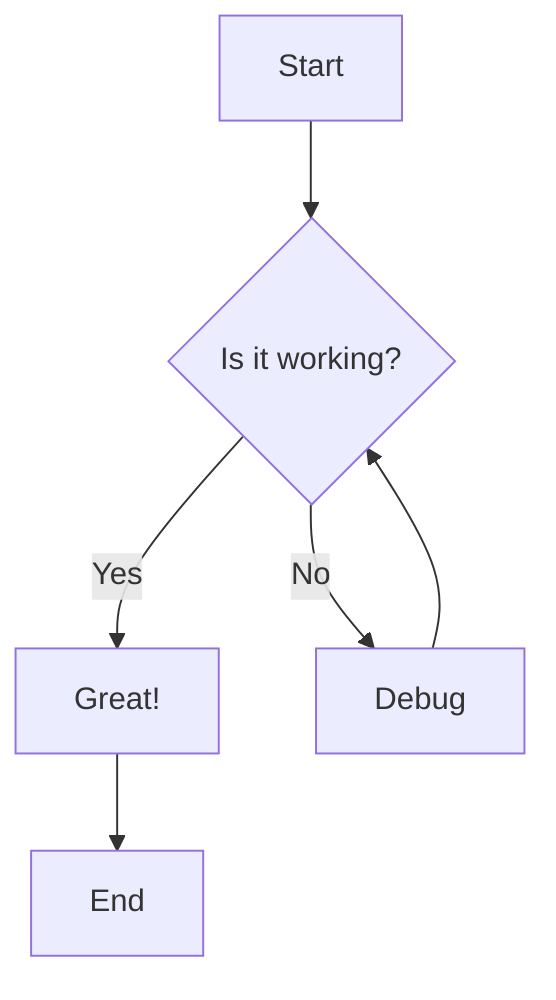
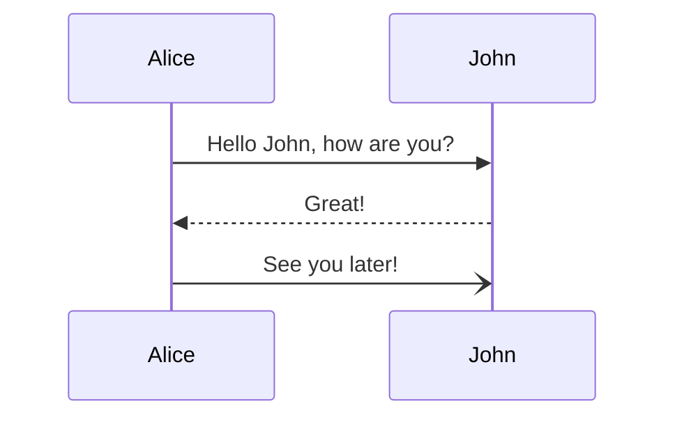
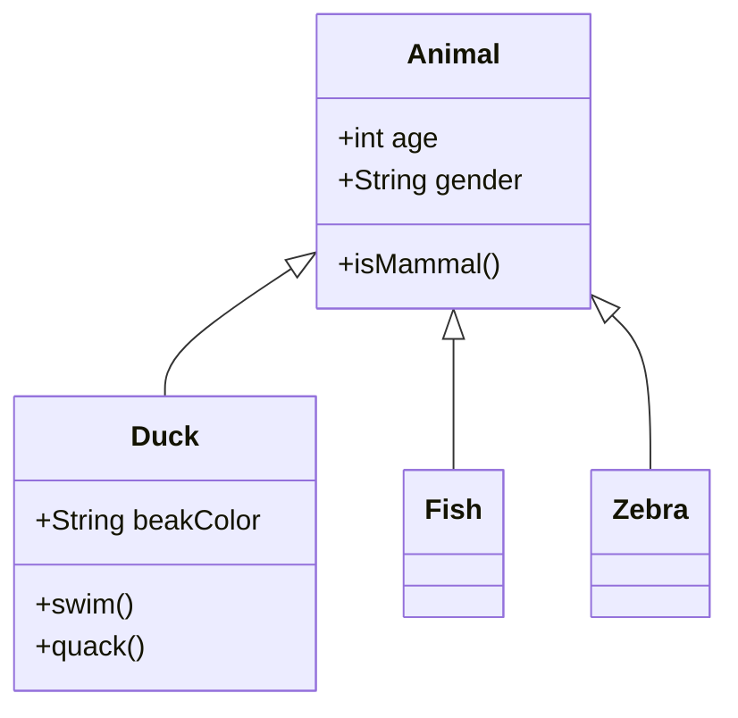
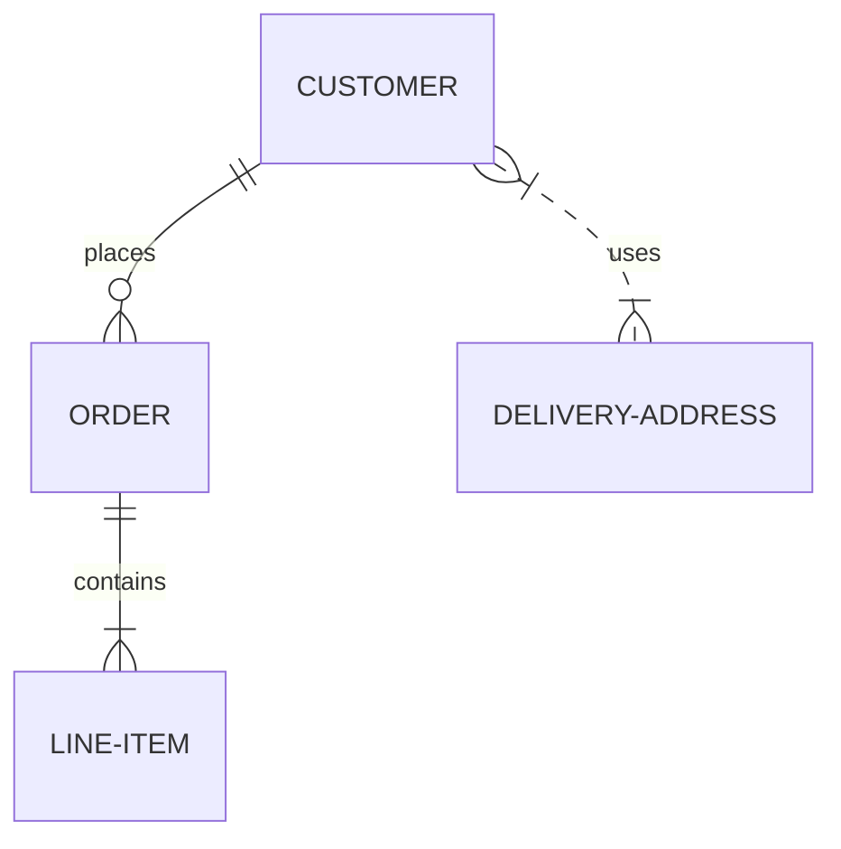
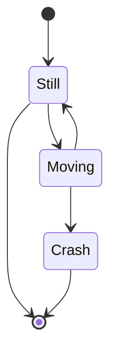
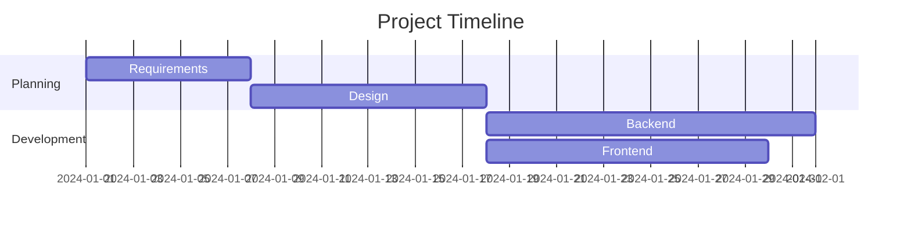

🛡️ <h1>hasib.live — Cybersecurity Portfolio & Security Engineering Website#</h1>
A professional, interactive cybersecurity portfolio website for Md. Hasib Islam, focused on web and API security, network attack-surface assessment, security automation, defensive AI research, and client-facing security consulting.

---

## Table of Contents

- [Overview](#overview)
- [Features](#features)
- [Usage Guide](#usage-guide)
- [Technology Stack](#technology-stack)
- [Code Examples](#code-examples)
- [Mathematical Expressions](#mathematical-expressions)
- [Mermaid Diagram Examples](#mermaid-diagram-examples)
- [Customization](#customization)
- [Accessibility](#accessibility)
- [Contributing](#contributing)
- [Browser Support](#browser-support)
- [Known Limitations](#known-limitations)
- [Troubleshooting](#troubleshooting)
- [License](#license)

---

## Overview

This application is a fully-featured Markdown viewer designed to render and display Markdown content with rich visual enhancements. It provides an interactive reading experience with navigation tools and support for advanced Markdown extensions including Mermaid diagrams, mathematical expressions, and syntax highlighting for code blocks.

---

## Features

### Core Features

- **Live Markdown Rendering**: Real-time rendering of Markdown content
- **Syntax Highlighting**: Support for multiple programming languages with themed highlighting
- **Table of Contents**: Auto-generated from document headings with smooth scrolling
- **Full-text Search**: Search functionality to find content within the document
- **Theming Support**: Automatically adapts to VS Code light, dark, and high-contrast themes

### Advanced Features

- **Mermaid Diagrams**: Render flowcharts, sequence diagrams, class diagrams, entity relationship diagrams, and other diagram types
- **KaTeX Math**: Support for mathematical expressions (inline and display)
- **Heading Anchors**: Auto-generated anchor links for each heading with copy-to-clipboard functionality
- **Responsive Design**: Works seamlessly on desktop and mobile devices
- **Interactive Diagrams**: Zoom, pan, and reset Mermaid diagrams
- **Frontmatter Support**: Display YAML frontmatter from Markdown files
- **Code Block Copy**: Copy code blocks with one click
- **Diagram Source Viewer**: View Mermaid diagram source code

---

## Usage Guide

### Viewing Content

The viewer renders the following Markdown elements:

- **Headings**: `# H1` through `###### H6`
- **Paragraphs**: Regular text blocks with proper spacing
- **Tables**: With left, center, and right alignment support
- **Blockquotes**: `> quoted text` with proper indentation
- **Code Blocks**: With syntax highlighting for multiple languages
- **Inline Code**: `code` with backticks
- **Lists**: Ordered and unordered lists with nesting support
- **Images**: `` with responsive sizing
- **Horizontal Rules**: `---` or `***`
- **Mermaid Diagrams**: Code blocks with `mermaid` language
- **Math**: Inline (`$...$`) and display (`$$...$$`) math using KaTeX
- **Frontmatter**: YAML frontmatter display in collapsible section

### Navigation Controls

| Control | Function |
|---------|----------|
| **Contents** | Toggle the Table of Contents sidebar |
| **Search** | Toggle the search bar |
| **Theme Detection** | Automatically follows VS Code theme |

### Interactive Features

#### Heading Anchors
- Each heading displays a link icon (`#`) on hover
- Click the anchor icon to copy the URL to that section
- The URL includes the heading slug for direct linking

#### Mermaid Diagrams
- **Zoom**: Use mouse wheel to zoom in/out
- **Pan**: Click and drag the diagram to pan
- **Reset**: Click "Reset View" button to return to default view
- **View Source**: Click "View Source" to see the diagram code

#### Code Blocks
- **Syntax Highlighting**: Automatic language detection
- **Copy Button**: Copy code to clipboard with one click
- **Language Label**: Shows the programming language used

---

## Technology Stack

### Frontend
- **HTML5**: Semantic markup with accessibility features
- **CSS3**: Custom styling with CSS variables for theming
- **JavaScript**: Vanilla JS for interactivity and rendering

### Libraries and Tools

| Library | Purpose |
|---------|---------|
| **Mermaid** | Diagram rendering engine |
| **KaTeX** | Mathematical expression rendering |
| **Custom Markdown Parser** | Full-featured parser with extensions |
| **Prism.js** | Syntax highlighting for code blocks |
| **VS Code Theme Variables** | Theme-aware design |

---

## Code Examples

### Python

```python
def fibonacci(n):
    """Return the nth Fibonacci number."""
    if n <= 1:
        return n
    return fibonacci(n-1) + fibonacci(n-2)

# Print first 10 Fibonacci numbers
for i in range(10):
    print(f"F({i}) = {fibonacci(i)}")
```

### JavaScript

```javascript
// Calculate factorial with error handling
function factorial(n) {
    if (n < 0) {
        throw new Error("Factorial is not defined for negative numbers");
    }
    if (n === 0 || n === 1) {
        return 1;
    }
    return n * factorial(n - 1);
}

try {
    console.log(factorial(5)); // Output: 120
} catch (error) {
    console.error(error.message);
}
```

### HTML/CSS

```html
<div class="container">
    <header>
        <h1>Welcome to My Site</h1>
        <nav>
            <ul>
                <li><a href="#home">Home</a></li>
                <li><a href="#about">About</a></li>
            </ul>
        </nav>
    </header>
</div>
```

```css
:root {
    --primary-color: #3498db;
    --text-color: #333;
    --background-color: #fff;
}

.container {
    max-width: 1200px;
    margin: 0 auto;
    padding: 20px;
}
```

---

## Mathematical Expressions

### Inline Math

You can use inline math with single dollar signs: $E = mc^2$

The quadratic formula is $x = \frac{-b \pm \sqrt{b^2 - 4ac}}{2a}$

Euler's identity: $e^{i\pi} + 1 = 0$

### Display Math

Use double dollar signs for display math:

$$
\frac{d}{dx} \left( \int_{0}^{x} f(u)\,du \right) = f(x)
$$

The Gaussian integral:

$$
\int_{-\infty}^{\infty} e^{-x^2} \, dx = \sqrt{\pi}
$$

### Complex Equations

Maxwell's equations:

$$
\begin{align}
\nabla \times \vec{\mathbf{B}} - \frac{1}{c}\frac{\partial\vec{\mathbf{E}}}{\partial t} &= \frac{4\pi}{c}\vec{\mathbf{j}} \\
\nabla \cdot \vec{\mathbf{E}} &= 4\pi\rho \\
\nabla \times \vec{\mathbf{E}} + \frac{1}{c}\frac{\partial\vec{\mathbf{B}}}{\partial t} &= 0 \\
\nabla \cdot \vec{\mathbf{B}} &= 0
\end{align}
$$

The Schrödinger equation:

$$
i\hbar\frac{\partial}{\partial t}\Psi(\mathbf{r},t) = \left[-\frac{\hbar^2}{2m}\nabla^2 + V(\mathbf{r})\right]\Psi(\mathbf{r},t)
$$

---

## Mermaid Diagram Examples

### Flowchart



### Sequence Diagram



### Class Diagram



### Entity Relationship Diagram



### State Diagram



### Gantt Chart



---

## Customization

### Adding Your Own Markdown

1. Open the HTML file in a text editor
2. Locate the `#app` content section
3. Add your Markdown content within the content area
4. Save and reload in your browser

### Theme Integration

The viewer automatically adapts to your VS Code theme:

| Theme Type | Background | Text Color | Accent Color |
|------------|------------|------------|--------------|
| **Light Theme** | Light | Dark | Blue |
| **Dark Theme** | Dark | Light | Blue |
| **High-Contrast** | Dark | Light | Yellow/Blue |

### CSS Variables

Key CSS variables for customization:

```css
:root {
    --omv-bg: var(--vscode-editor-background);
    --omv-fg: var(--vscode-editor-foreground);
    --omv-muted: var(--vscode-descriptionForeground);
    --omv-border: var(--vscode-panel-border);
    --omv-accent: var(--vscode-textLink-foreground);
    --omv-code-bg: var(--vscode-textCodeBlock-background);
    --omv-sidebar-width: 260px;
}
```

---

## Accessibility

### Keyboard Navigation

- **Tab**: Navigate through interactive elements
- **Enter**: Activate buttons and links
- **Space**: Scroll page
- **Escape**: Close modals/panels
- **Arrow Keys**: Navigate within tables

### Screen Reader Support

- **Semantic HTML**: Proper use of headings and ARIA roles
- **ARIA Labels**: All interactive elements have descriptive labels
- **Focus Management**: Logical focus order with visible indicators
- **Live Regions**: Dynamic content updates announced

### Color Contrast

- **WCAG Compliance**: All text meets WCAG AA contrast requirements
- **Color Independence**: Information not conveyed by color alone
- **Focus Indicators**: Clear visual focus states

### Reduced Motion

The viewer respects system preferences:
- **CSS**: `@media (prefers-reduced-motion: reduce)`
- **Smooth Scrolling**: Disabled when requested
- **Animations**: Disabled or simplified

---

## Contributing

### Development Setup

1. Clone the repository
2. Make changes to the HTML file
3. Test in your browser
4. Submit a pull request

### Guidelines

- **Single File**: Keep the single-file structure
- **Coding Style**: Follow existing conventions
- **Responsiveness**: Ensure features work on all screen sizes
- **Accessibility**: Maintain WCAG compliance
- **Documentation**: Update README for new features

### Feature Requests

When suggesting features, consider:
- Utility for Markdown users
- Performance impact
- Implementation complexity
- Maintenance requirements

### Bug Reports

Include:
1. **Description**: What happened vs. expected
2. **Steps to Reproduce**: Detailed steps
3. **Expected Behavior**: What should have occurred
4. **Environment**: Browser, OS, version
5. **Screenshots**: If applicable

---

## Browser Support

| Browser | Version | Status |
|---------|---------|--------|
| **Chrome** | Latest | ✅ Full Support |
| **Firefox** | Latest | ✅ Full Support |
| **Edge** | Latest | ✅ Full Support |
| **Safari** | Latest | ✅ Full Support |
| **Opera** | Latest | ✅ Full Support |
| **Mobile Chrome** | Latest | ✅ Full Support |
| **Mobile Safari** | Latest | ✅ Full Support |

---

## Known Limitations

### Performance
- **Large Documents**: May experience issues with documents over 100KB
- **Many Diagrams**: Multiple complex diagrams may slow rendering

### Mermaid Diagrams
- **Complex Layouts**: Some complex diagrams may need adjustment
- **Browser Memory**: Large diagrams may consume significant memory

### Markdown Features
- **Custom CSS**: Limited support for custom CSS in Markdown
- **HTML Tags**: Some HTML tags may be sanitized for security

### Browser Compatibility
- **IE11**: Not supported
- **Legacy Browsers**: May need polyfills

---

## Troubleshooting

### Common Issues

#### Mermaid Diagrams Not Rendering
- Check the diagram syntax
- Verify the diagram type is supported
- Click "View Source" to debug

#### Search Not Working
- Ensure the document is fully loaded
- Check if the search term exists
- Try refreshing the page

#### Theme Not Matching VS Code
- Restart your browser or editor
- Check VS Code theme settings
- Force refresh (Ctrl+F5)

#### Tables Not Aligning
- Check table syntax for alignment markers
- Ensure proper number of columns
- Verify header separation

### Getting Help
- **GitHub Issues**: Report bugs
- **Documentation**: Check the README
- **Community**: Use GitHub Discussions

---

## License

This project is licensed under the **MIT License**.

```
MIT License

Copyright (c) 2024

Permission is hereby granted, free of charge, to any person obtaining a copy
of this software and associated documentation files (the "Software"), to deal
in the Software without restriction, including without limitation the rights
to use, copy, modify, merge, publish, distribute, sublicense, and/or sell
copies of the Software, and to permit persons to whom the Software is
furnished to do so, subject to the following conditions:

The above copyright notice and this permission notice shall be included in all
copies or substantial portions of the Software.

THE SOFTWARE IS PROVIDED "AS IS", WITHOUT WARRANTY OF ANY KIND, EXPRESS OR
IMPLIED, INCLUDING BUT NOT LIMITED TO THE WARRANTIES OF MERCHANTABILITY,
FITNESS FOR A PARTICULAR PURPOSE AND NONINFRINGEMENT. IN NO EVENT SHALL THE
AUTHORS OR COPYRIGHT HOLDERS BE LIABLE FOR ANY CLAIM, DAMAGES OR OTHER
LIABILITY, WHETHER IN AN ACTION OF CONTRACT, TORT OR OTHERWISE, ARISING FROM,
OUT OF OR IN CONNECTION WITH THE SOFTWARE OR THE USE OR OTHER DEALINGS IN THE
SOFTWARE.
```

---

## Credits

- **Mermaid**: [Mermaid.js](https://mermaid.js.org/) for diagram rendering
- **KaTeX**: [KaTeX](https://katex.org/) for mathematical typesetting
- **Prism.js**: [Prism](https://prismjs.com/) for syntax highlighting
- **VS Code**: Theme variables from Visual Studio Code

---

## Changelog

### Version 1.0.0
- Initial release
- Core Markdown rendering
- Syntax highlighting
- Table of contents
- Search functionality
- Mermaid diagram support
- KaTeX math support
- Theme integration

### Version 1.1.0
- Added diagram zoom and pan
- Improved mobile responsiveness
- Enhanced search highlighting
- Added code copy functionality
- Fixed various bugs

---

*Built with ❤️ for Markdown enthusiasts*

[Back to Top](#online-markdown-viewer)
